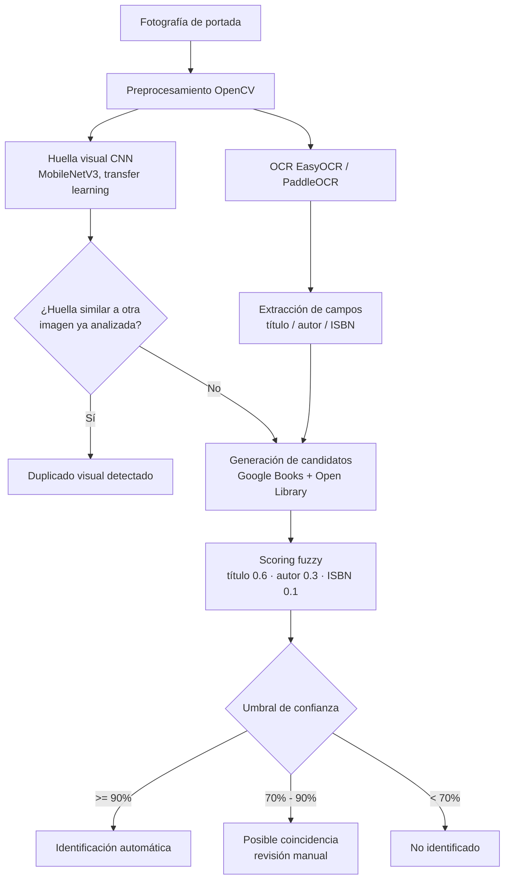
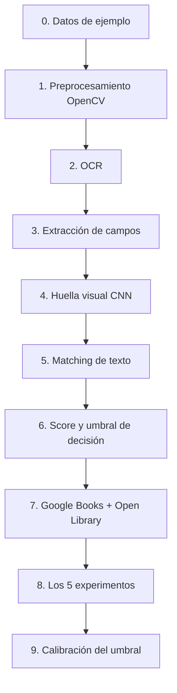

# Documentación técnica — BookVision (núcleo algorítmico)

> Este documento describe el **núcleo algorítmico** entregado como TFM en
> este repositorio (el notebook `TFM_BookVision_Nucleo_Algoritmico.ipynb`).
> No describe una aplicación de escritorio/web independiente: no hay
> `app/`, `src/`, `main.py` ni base de datos en este repositorio, por no
> ser el objeto de estudio de este TFM (ver "Trabajo futuro" al final de
> este documento).

## 1. Problema y alcance

**Problema.** La catalogación manual de libros (título, autor, editorial,
ISBN...) a partir de un ejemplar físico es lenta y propensa a errores.
Se quiere automatizar ese proceso a partir de una única fotografía de la
portada.

**Alcance de este TFM (este repositorio).**
- Identificación de un libro a partir de UNA fotografía de portada.
- Extracción de metadatos (título, autor, ISBN si aparece).
- Cálculo de similitud visual entre dos portadas para detectar si
  corresponden al mismo ejemplar físico (sin persistencia: se compara
  imagen contra imagen, no contra un inventario guardado).
- Evaluación experimental cuantitativa del sistema, incluida una
  calibración empírica del umbral de decisión sobre fotografías reales.

**Fuera de alcance de este repositorio** (líneas futuras — ver
[LIMITACIONES.md](LIMITACIONES.md)): persistencia en base de datos,
interfaz de usuario, corrección manual interactiva, reconocimiento en
vídeo/tiempo real, reconocimiento de lomos de estantería completa,
entrenamiento de un modelo propio de clasificación de portadas (se usa
transfer learning, no entrenamiento desde cero), app móvil nativa.

## 2. Requisitos

### Requisitos funcionales
- RF1: El sistema debe aceptar una imagen (JPG/PNG/BMP) como entrada.
- RF2: Debe preprocesar la imagen para mejorar la calidad del OCR.
- RF3: Debe extraer texto de la portada mediante OCR.
- RF4: Debe identificar candidatos de título, autor e ISBN.
- RF5: Debe consultar al menos una fuente externa de metadatos bibliográficos.
- RF6: Debe calcular un nivel de confianza para la identificación.
- RF7: Debe permitir tres estados de resultado: identificación automática,
  posible coincidencia (revisión manual) y no identificado.
- RF8: Debe calcular la similitud visual entre dos portadas para detectar
  posibles duplicados, sin requerir persistencia de datos.

### Requisitos no funcionales
- RNF1: Reproducibilidad — instalable únicamente con `pip`, ejecutable con
  Jupyter, sin binarios de sistema externos (se descartó Tesseract por
  este motivo, ver §4).
- RNF2: Debe funcionar en CPU (no debe requerir GPU).
- RNF3: Tiempo de ejecución por celda razonable para una demo interactiva
  (objetivo: <30s en CPU por imagen con los motores por defecto).
- RNF4: El resultado de cada etapa debe poder verificarse por comparación
  directa con resultados ya validados del proyecto, y el notebook debe
  poder ejecutarse de extremo a extremo de forma reproducible
  (`jupyter nbconvert --execute`).
- RNF5: No debe requerir credenciales para el funcionamiento básico
  (Google Books y Open Library se usan en modo público).
- RNF6: No se recopilan ni persisten datos personales; solo se procesan
  imágenes de portadas de libros, en memoria, durante la ejecución de
  cada celda.

### Limitaciones conocidas
Ver [LIMITACIONES.md](LIMITACIONES.md).

### Riesgos
| Riesgo | Mitigación |
|---|---|
| Rate limiting de Google Books API | Open Library como fuente redundante (sección 7 del notebook); reintentos acotados |
| Dataset sin fotos reales al inicio | Validación posterior con 253 fotografías reales (ver [RESULTADOS_FOTOS_REALES.md](RESULTADOS_FOTOS_REALES.md)) |
| Ambigüedad título/autor en el layout | Heurística basada en tamaño de fuente (bbox, sección 3 del notebook) + scoring permisivo con validación posterior |
| Portadas muy ilustradas con poco texto | Estado explícito de "no identificado" |

## 3. Arquitectura

### 3.1 Diagrama de flujo del pipeline



Nota: en este repositorio el resultado de K/L/M/G es la salida de la celda
correspondiente del notebook (§3.7 de la memoria), no una inserción en
base de datos — ver la nota al inicio de este documento.

### 3.2 Estructura del notebook

Este núcleo algorítmico no se organiza como un paquete de software con
módulos independientes (`src/`, imports cruzados), sino como un único
notebook con diez secciones numeradas que siguen el orden del diagrama
anterior, más dos secciones finales de evaluación:



### 3.3 Justificación de la arquitectura

El pipeline separa **extracción permisiva** (OCR + heurísticas de layout
generan varios candidatos de título/autor sin exigir certeza) de
**validación estricta** (el scoring contra fuentes externas decide si la
identificación es suficientemente fiable). Esta separación es más
robusta frente al ruido inherente del OCR que intentar clasificar con
certeza absoluta cada línea de texto en el momento de la extracción.

La **huella visual (CNN)** no se usa para identificar el título del
libro (no existe un dataset público suficientemente grande de portadas
etiquetadas para entrenar/ajustar eso de forma fiable en el marco de un
TFM), sino para una tarea donde SÍ aporta valor de forma robusta:
detectar si dos fotografías corresponden al mismo ejemplar físico, aunque
el ángulo/luz de la foto cambie. Esto es coherente con el enfoque de
"transfer learning" indicado en el anteproyecto: se reutiliza una CNN
preentrenada en ImageNet (MobileNetV3-Small) como extractor de
características visuales genéricas (color, textura, composición), sin
necesidad de reentrenarla ni ajustarla (fine-tuning).

## 4. Tecnologías y justificación de decisiones

| Decisión | Elegido | Alternativas consideradas | Justificación |
|---|---|---|---|
| OCR | EasyOCR + PaddleOCR | Tesseract | Tesseract requiere un binario de sistema (falló su instalación silenciosa por necesitar permisos de administrador en el entorno de desarrollo); EasyOCR/PaddleOCR son 100% instalables vía pip. En este repositorio, la sección 2 del notebook reutiliza por defecto resultados de OCR ya calculados (`results/ocr_raw_results.csv`) para no depender de instalar ninguno de los dos; PaddleOCR queda como dependencia **opcional** en `requirements.txt` solo para quien quiera ejecutar la celda de OCR en vivo |
| CNN visual | MobileNetV3-Small (torchvision, ImageNet) | ResNet50, CLIP | Suficiente capacidad discriminativa para embeddings de portada; mucho más ligera → viable en CPU, cumpliendo RNF2 |
| Matching | RapidFuzz | difflib (stdlib), FuzzyWuzzy | Implementación en C++, mucho más rápida; API idéntica a FuzzyWuzzy pero sin su dependencia GPL problemática |
| Metadatos | Google Books + Open Library | WorldCat, ISBNdb | Ambas gratuitas y sin necesidad de API key; se combinan para maximizar cobertura (sección 7 del notebook: Google Books primero, Open Library como respaldo si falla o no hay resultados) |
| Entorno de ejecución | Jupyter Notebook | Script de línea de comandos, Google Colab | Combina código, explicación y resultados en un único documento autocontenido, legible por un tribunal sin necesidad de ejecutar nada |

Una eventual persistencia en base de datos y una interfaz de usuario no
forman parte de esta tabla porque no son decisiones de diseño del núcleo
algorítmico de este repositorio, al no ser objeto de estudio de este TFM
(ver "Trabajo futuro").

## 5. Estructura del resultado por imagen

Al no incluir una capa de persistencia, el núcleo algorítmico representa
el resultado de analizar una fotografía como una estructura de datos en
memoria (la fila de `tabla_resultados` en la sección 6 del notebook, o el
diccionario `candidato` en la sección 7), con los siguientes campos:

| Campo | Descripción |
|---|---|
| `titulo_extraido` / `title_guess` | Título candidato obtenido por OCR |
| `sim_titulo` | Similitud fuzzy entre el título OCR y el candidato |
| `sim_autor` | Similitud fuzzy entre el autor OCR y el candidato |
| `isbn` / `isbn_match` | ISBN detectado y coincidencia exacta (1.0/0.0) con el candidato, cuando hay uno disponible |
| `score` | Puntuación combinada (§6) |
| `estado` | automática / revisión manual / no identificado |

Una eventual extensión con persistencia podría ampliar esta misma
estructura con una clave primaria y marcas temporales de auditoría para
guardarla en una base de datos, pero esa persistencia no forma parte del
objeto de estudio de este TFM.

## 6. Sistema de identificación (Fase 6 del anteproyecto)

```
score = 0.6 · similitud(título_ocr, título_candidato)
      + 0.3 · similitud(autor_ocr, autor_candidato)
      + 0.1 · coincidencia_isbn_exacta

Si score >= 0.90              → identificación automática
Si 0.70 <= score < 0.90       → posible coincidencia (revisión manual)
Si score < 0.70                → no identificado
```

Los pesos (0.6/0.3/0.1) y umbrales (0.90/0.70) son los valores por
defecto documentados en el anteproyecto, definidos como constantes al
inicio de la sección 6 del notebook (`WEIGHT_TITLE`, `WEIGHT_AUTHOR`,
`WEIGHT_OTHER`, `THRESHOLD_AUTO`, `THRESHOLD_REVIEW`), ajustables
directamente ahí sin modificar el resto del código. La sección 6 aplica
los dos primeros términos sobre el dataset sintético (que no lleva ISBN
de referencia, por lo que ese término es 0.0 por construcción en esa
demo); la sección 7 aplica la fórmula completa con sus tres términos
sobre un candidato real obtenido de Google Books u Open Library. Su
idoneidad se evalúa experimentalmente en el Experimento 4 y, de forma
mucho más rigurosa, en la calibración empírica del umbral de decisión
sobre 253 fotografías reales — ver
[RESULTADOS_FOTOS_REALES.md](RESULTADOS_FOTOS_REALES.md).

## 7. Metodología experimental y métricas

Ver [EXPERIMENTOS.md](EXPERIMENTOS.md) para el detalle de cada
experimento y [RESULTADOS.md](RESULTADOS.md) para los resultados
obtenidos sobre el dataset sintético. Métricas usadas:

- **CER / WER** (Character / Word Error Rate): calidad del texto
  reconocido por el OCR frente al texto de referencia real de la portada.
- **Accuracy de identificación**: proporción de casos en que el libro
  correcto se identifica (a distintos niveles de exigencia: automático,
  automático+revisión).
- **Precisión / cobertura / recall**: ver
  [RESULTADOS_FOTOS_REALES.md](RESULTADOS_FOTOS_REALES.md) para la
  calibración empírica del umbral de decisión sobre 253 fotografías
  reales, que usa estas tres métricas en lugar de accuracy global.
- **Tiempos**: preprocesado, OCR, matching y total, medidos por imagen.

## 8. Reproducibilidad

El notebook de este repositorio se instala con
`pip install -r requirements.txt` (ver [README.md](../README.md)) y se
ejecuta con `jupyter notebook`. No requiere GPU, no requiere binarios de
sistema, no requiere credenciales. Las versiones exactas de las
dependencias están fijadas en `requirements.txt`. Se ha validado que el
notebook se ejecuta de extremo a extremo sin intervención manual con:

```bash
jupyter nbconvert --execute --to notebook TFM_BookVision_Nucleo_Algoritmico.ipynb
```

## Trabajo futuro

Este documento describe íntegramente el núcleo algorítmico que constituye
el objeto de estudio de este TFM. Como posible continuación futura del
proyecto, se plantea la posibilidad de envolver este núcleo algorítmico en
una aplicación completa (interfaz de usuario, persistencia de resultados
en base de datos, línea de comandos), pero esa ingeniería de aplicación no
formaba parte del objeto de estudio de este TFM y, por tanto, no se ha
abordado en este trabajo. Los resultados ya calculados que este
repositorio reutiliza en `results/*.csv` se generaron mediante scripts de
evaluación durante el desarrollo del proyecto — ver
[EXPERIMENTOS.md](EXPERIMENTOS.md).
