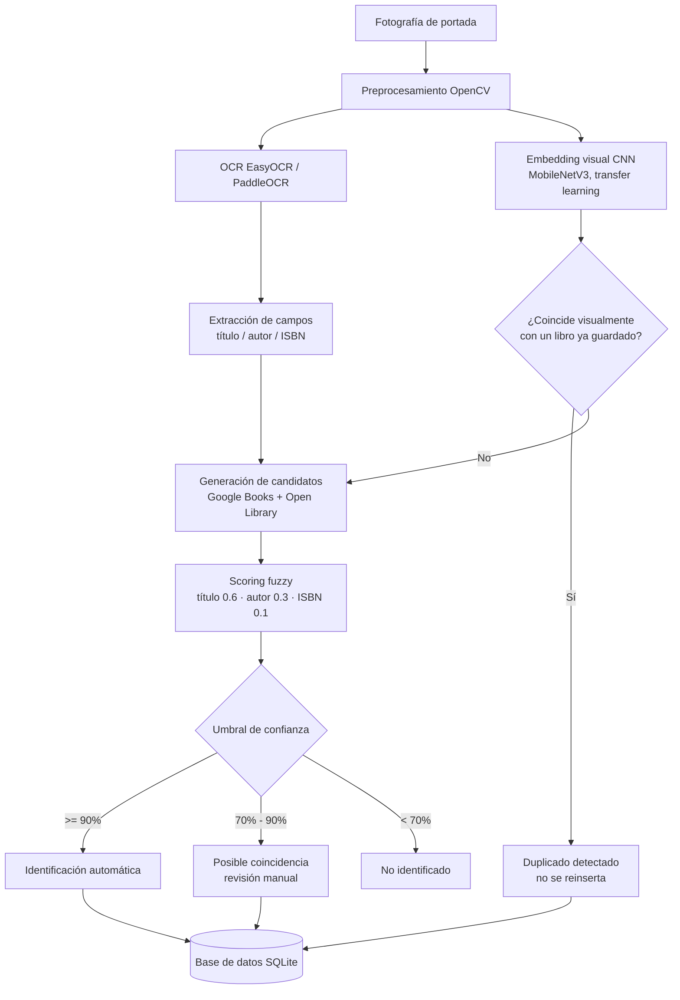
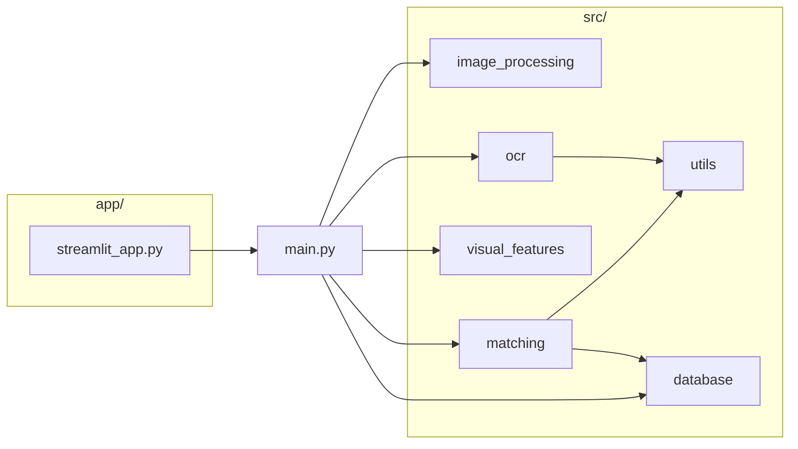
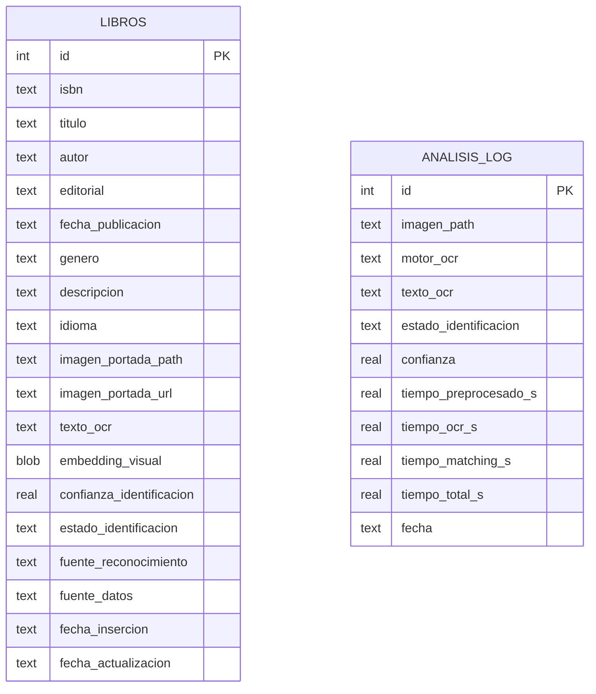

# Documentación técnica — BookVision

## 1. Problema y alcance

**Problema.** La catalogación manual de libros (título, autor, editorial,
ISBN...) a partir de un ejemplar físico es lenta y propensa a errores.
Se quiere automatizar ese proceso a partir de una única fotografía de la
portada.

**Alcance de este TFM.**
- Identificación de un libro a partir de UNA fotografía de portada.
- Extracción de metadatos (título, autor, editorial, ISBN si aparece,
  fecha de publicación, género, descripción, idioma).
- Detección de duplicados en el inventario (mismo ejemplar fotografiado
  dos veces).
- Corrección manual cuando la confianza automática es baja.
- Evaluación experimental cuantitativa del sistema.

**Fuera de alcance** (posibles líneas futuras, ver
[LIMITACIONES.md](LIMITACIONES.md)): reconocimiento en vídeo/tiempo real,
reconocimiento de lomos de estantería completa, entrenamiento de un modelo propio
de clasificación de portadas (se usa transfer learning, no entrenamiento
desde cero), app móvil nativa.

## 2. Requisitos

### Requisitos funcionales
- RF1: El sistema debe aceptar una imagen (JPG/PNG/BMP) como entrada.
- RF2: Debe preprocesar la imagen para mejorar la calidad del OCR.
- RF3: Debe extraer texto de la portada mediante OCR.
- RF4: Debe identificar candidatos de título, autor e ISBN.
- RF5: Debe consultar al menos una fuente externa de metadatos bibliográficos.
- RF6: Debe calcular un nivel de confianza para la identificación.
- RF7: Debe permitir tres estados de resultado: identificación automática,
  posible coincidencia (revisión manual) y no identificado.
- RF8: Debe almacenar el libro identificado en una base de datos persistente.
- RF9: Debe evitar insertar duplicados (mismo ISBN o misma portada visual).
- RF10: Debe permitir consultar, corregir y eliminar libros del inventario.
- RF11: Debe ofrecer una interfaz de usuario para todo el flujo anterior.

### Requisitos no funcionales
- RNF1: Reproducibilidad — instalable únicamente con `pip`, sin binarios
  de sistema externos (se descartó Tesseract por este motivo, ver §5).
- RNF2: Debe funcionar en CPU (no debe requerir GPU).
- RNF3: Tiempo de procesamiento por imagen razonable para una demo en
  directo (objetivo: <30s en CPU con los motores por defecto).
- RNF4: El código debe estar testeado (pytest) y documentado.
- RNF5: No debe requerir credenciales para el funcionamiento básico
  (Google Books y Open Library se usan en modo público).
- RNF6: Los datos personales no se recopilan; solo se procesan imágenes
  de portadas de libros.

### Limitaciones conocidas
Ver [LIMITACIONES.md](LIMITACIONES.md).

### Riesgos
| Riesgo | Mitigación |
|---|---|
| Rate limiting de Google Books API | Open Library como fuente redundante; backoff exponencial; reintentos acotados |
| Dataset sin fotos reales al inicio | Generador de dataset sintético con condiciones variadas + pipeline preparado para sustitución directa |
| Ambigüedad título/autor en el layout | Heurística basada en tamaño de fuente (bbox) + fallback + scoring permisivo con validación posterior |
| Portadas muy ilustradas con poco texto | Detección de "no identificado" explícita + corrección manual en la UI |

## 3. Arquitectura

### 3.1 Diagrama de flujo del pipeline



### 3.2 Arquitectura de módulos



### 3.3 Justificación de la arquitectura

El pipeline separa **extracción permisiva** (OCR + heurísticas de layout
generan varios candidatos de título/autor sin exigir certeza) de
**validación estricta** (el scoring contra fuentes externas decide si la
identificación es suficientemente fiable). Esta separación es más
robusta frente al ruido inherente del OCR que intentar clasificar con
certeza absoluta cada línea de texto en el momento de la extracción.

El **embedding visual CNN** no se usa para identificar el título del
libro (no existe un dataset público suficientemente grande de portadas
etiquetadas para entrenar/ajustar eso de forma fiable en el marco de un
TFM), sino para dos tareas donde SÍ aporta valor de forma robusta:
detección de duplicados y re-identificación de un ejemplar ya conocido
del propio inventario, aunque el ángulo/luz de la foto cambie. Esto es
coherente con el enfoque de "transfer learning" indicado en el
anteproyecto: se reutiliza una CNN preentrenada en ImageNet
(MobileNetV3-Small) como extractor de características visuales
genéricas (color, textura, composición), sin necesidad de reentrenarla.

## 4. Tecnologías y justificación de decisiones

| Decisión | Elegido | Alternativas consideradas | Justificación |
|---|---|---|---|
| OCR | EasyOCR + PaddleOCR | Tesseract | Tesseract requiere un binario de sistema (falló su instalación silenciosa por necesitar permisos de administrador en el entorno de desarrollo); EasyOCR/PaddleOCR son 100% instalables vía pip, garantizando reproducibilidad total con `pip install -r requirements.txt` |
| CNN visual | MobileNetV3-Small (torchvision, ImageNet) | ResNet50, CLIP | Suficiente capacidad discriminativa para embeddings de portada; mucho más ligera → viable en CPU, cumpliendo RNF2 |
| Matching | RapidFuzz | difflib (stdlib), FuzzyWuzzy | Implementación en C++, mucho más rápida; API idéntica a FuzzyWuzzy pero sin su dependencia GPL problemática |
| Metadatos | Google Books + Open Library | WorldCat, ISBNdb | Ambas gratuitas y sin necesidad de API key para el uso del proyecto; se combinan para maximizar cobertura |
| Base de datos | SQLite | PostgreSQL, MongoDB | Cero configuración, un solo archivo, suficiente para el volumen de un inventario personal/TFM |
| Interfaz | Streamlit | Flask+HTML, Gradio | Permite construir una UI funcional completa (subida de imagen, tablas, formularios) con muy poco código, apropiado para el alcance del proyecto |

## 5. Modelo de datos



`fuente_reconocimiento` toma los valores `ocr` (identificado por texto),
`visual` (duplicado detectado por embedding, sin nueva identificación
textual) o `combinada` (ISBN leído por OCR coincide exactamente con el
candidato encontrado). `analisis_log` registra CADA análisis ejecutado
(se guarde o no el libro), usado para trazabilidad y para los experimentos.

## 6. Sistema de identificación (Fase 6)

```
score = 0.6 · similitud(título_ocr, título_candidato)
      + 0.3 · similitud(autor_ocr, autor_candidato)
      + 0.1 · coincidencia_isbn_exacta

Si score >= 0.90              → identificación automática
Si 0.70 <= score < 0.90       → posible coincidencia (revisión manual)
Si score < 0.70                → no identificado
```

Los pesos (0.6/0.3/0.1) y umbrales (0.90/0.70) son los valores por
defecto documentados en el anteproyecto; su idoneidad se evalúa
experimentalmente en el Experimento 4 (ver
[EXPERIMENTOS.md](EXPERIMENTOS.md)) y pueden ajustarse en
`config.py::MatchingConfig` sin tocar el resto del código.

## 7. Metodología experimental y métricas

Ver [EXPERIMENTOS.md](EXPERIMENTOS.md) para el detalle de cada
experimento y [RESULTADOS.md](RESULTADOS.md) para los resultados
obtenidos. Métricas usadas:

- **CER / WER** (Character / Word Error Rate, vía `jiwer`): calidad del
  texto reconocido por el OCR frente al texto de referencia real de la
  portada.
- **Accuracy de identificación**: proporción de casos en que el libro
  correcto se identifica (a distintos niveles de exigencia: automático,
  automático+revisión).
- **Tiempos**: preprocesado, OCR, matching y total, medidos por imagen.

## 8. Reproducibilidad

Todo el proyecto se instala con `pip install -r requirements.txt` (ver
[README.md](../README.md)). No requiere GPU, no requiere binarios de
sistema, no requiere credenciales. Las versiones exactas de cada
dependencia están fijadas en `requirements.txt`. La semilla aleatoria
(`config.RANDOM_SEED = 42`) se usa en la generación del dataset sintético
para que sea reproducible.
