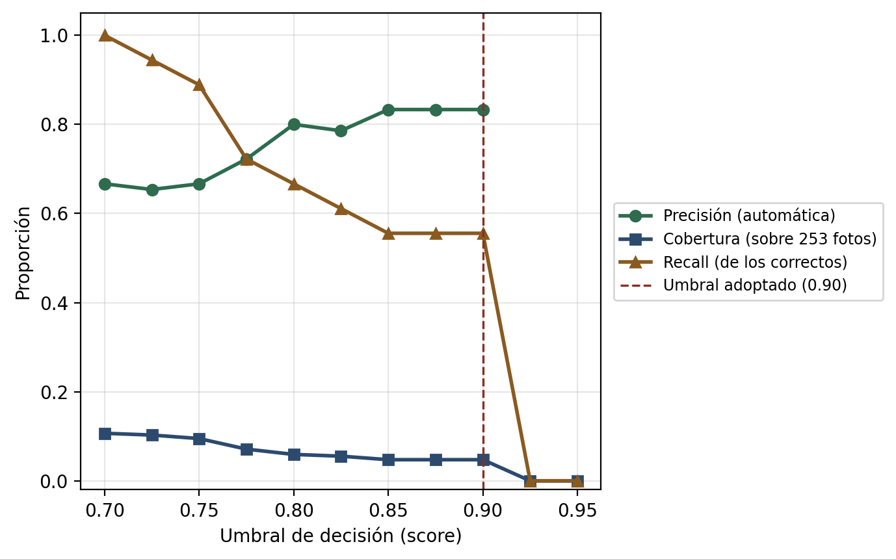

# Evaluación con fotografías reales

> **Nota de alcance:** esta evaluación se ejecutó aplicando el mismo
> algoritmo que demuestra el notebook de este repositorio, sobre 253
> fotografías reales tomadas por el autor. Las fotografías no se
> distribuyen (derechos de autor de las portadas); solo se documentan
> aquí las cifras agregadas.

A diferencia de los 5 experimentos sobre el dataset sintético (ver
[RESULTADOS.md](RESULTADOS.md)), esta evaluación usa **253 fotografías
reales** de portadas de libros físicos, aportadas por el autor del TFM
con su teléfono móvil, en condiciones de captura no controladas (sin
instrucciones sobre orientación, luz o encuadre). El ground truth
(título/autor real de cada foto) se estableció por inspección visual
manual de cada fotografía.

> **Nota sobre el histórico**: la primera validación (2026-08-19) usó un
> lote de 34 fotos. El 2026-08-31 el autor amplió el lote con 219 fotos
> adicionales (253 en total) y se repitió la evaluación completa; las
> cifras de esta página son las del lote ampliado. Se conserva el
> análisis cualitativo original (falso positivo de saga, hipótesis de
> rotación) porque sigue siendo válido y se confirma con el lote mayor.

Los resultados completos anotados por fotografía no se versionan en este
repositorio por contener referencias a portadas con derechos de autor;
solo se documentan aquí las cifras agregadas.

## Resultado global

| Métrica | Valor |
|---|---|
| Fotos evaluadas | 253 |
| Identificaciones correctas (automática o revisión, verificadas) | 18 / 253 (7.1%) |
| **Precisión de "identificación automática"** (score ≥ 90%) | **10 / 12 (83.3%)** |
| Identificaciones "para revisión manual" que resultaron correctas | 8 / 15 (53.3%) |
| De las fotos no identificadas, el título real SÍ estaba bien leído por el OCR | 127 / 226 (56.2%) |

La cifra más importante de esta tabla sigue sin ser el 7.1% de accuracy
global —predecible, dado que el sistema usa un umbral deliberadamente
conservador (§ Discusión)—, sino la **precisión del 83.3% en las
identificaciones "automáticas"**: de los 12 casos en que el sistema
afirmó estar seguro (≥90%), solo 2 eran incorrectos. Es una cifra
más alta y con una base mucho mayor que el 66.7% (2/3) del lote de 34
fotos, lo que refuerza la conclusión: cuando el sistema se declara
seguro, se puede confiar en él en la gran mayoría de los casos. Ambos
falsos positivos se documentan explícitamente (ver "Falsos positivos
detectados" más abajo), no se ocultan.

## ¿Es la rotación de la foto el problema? Los datos dicen que NO

La hipótesis inicial, formada al observar visualmente que varias fotos
se capturaron giradas 90°/180° (con el lomo hacia arriba en vez de la
portada recta), era que la rotación sería la causa principal de fallo.
**Los datos no confirman esa hipótesis:**

| Condición de captura | n | Similitud media título OCR vs. real | Identificaciones confirmadas |
|---|---|---|---|
| Frontal / recta | 185 | 0.598 | 15 |
| Rotada 90°/180° | 68 | 0.597 | 3 |

Con el lote ampliado (253 fotos) la similitud media del texto leído por
el OCR es prácticamente **idéntica** entre fotos frontales y rotadas
(0.598 vs. 0.597) — confirma, con una base seis veces mayor, la misma
conclusión que con las 34 fotos originales. Esto se explica porque
tanto EasyOCR como PaddleOCR incorporan un clasificador de ángulo
interno que corrige rotaciones de 90°/180° antes de reconocer el
texto, algo que Tesseract (descartado en la Fase 4, ver
[DOCUMENTACION_TECNICA.md](DOCUMENTACION_TECNICA.md)) no habría
gestionado igual de bien. **Conclusión, corrigiendo la hipótesis
inicial con evidencia y ahora reconfirmada a mayor escala:** la
rotación de la foto no es el cuello de botella real del sistema.

## El cuello de botella real: la fase de matching/APIs, no el OCR

En **127 de las 226 fotos no identificadas (56.2%)** el texto extraído
por el OCR correspondía, con alta fidelidad, al título real del libro,
y sin embargo la identificación final NO se confirmó — una proporción
todavía mayor que el 44% observado en el lote de 34 fotos. Ejemplos
textuales (texto OCR crudo → título real, tomados del lote original):

| Texto identificado por el sistema | Título real | ¿Por qué falló el matching? |
|---|---|---|
| `DIVERGENTE` | Divergente | Sin candidato de autor útil en el query (solo se buscó con el eslogan de la portada) |
| `Zafiro` / `Rubi` / `Esmeralda` | Zafiro / Rubí / Esmeralda | Título de una sola palabra, alta ambigüedad en la búsqueda; banner promocional interfirió en el campo "autor" |
| `LOS CINCO SE ESCAPAN` | Los cinco se escapan | Candidato probablemente no indexado o autor mal extraído |
| `PRUEBAS` | Las pruebas | Score 39.7%, por debajo del umbral de revisión (0.70) |
| `TOLEDO La llamada del agua` | La llamada del agua | Edición local (Diputación de Toledo), no indexada en Google Books/Open Library |

**Conclusión:** el cuello de botella principal en las fotografías
reales es la **fase de generación/validación de candidatos** (rate
limiting de Google Books, cobertura incompleta de ediciones locales o
minoritarias en Open Library, y la heurística de extracción de
título/autor demasiado permisiva cuando el diseño de la portada no
tiene una jerarquía tipográfica clara) — no la calidad del
reconocimiento de texto en sí, que en muchos casos fue prácticamente
perfecta. Esto es coherente con el hallazgo ya documentado en los
Experimentos 3 y 4 sobre el dataset sintético (ver
[RESULTADOS.md](RESULTADOS.md)).

## El límite de peticiones de Google Books, confirmado como cuello de botella a escala

La limitación ya prevista en
[LIMITACIONES.md](LIMITACIONES.md) §3 ("en un uso intensivo podría
notarse una degradación temporal de Google Books") se confirmó con
datos al pasar de 34 a 253 fotos evaluadas de forma consecutiva: el
registro de ejecución mostró avisos `429 Too Many Requests` de forma
prácticamente continua durante buena parte del proceso, con reintentos y
backoff antes de caer a Open Library como respaldo. El efecto directo es
que la proporción de fotos
"no identificadas" subió del 76.5% (26/34) al 89.3% (226/253): no
porque el sistema "lea" o "razone" peor con más fotos, sino porque la
fuente de metadatos principal se satura con un volumen de consultas
consecutivo — exactamente el escenario de "biblioteca real" con
cientos de libros seguidos que ya se anticipaba como riesgo. Es una
limitación real de escalabilidad del sistema tal y como está
configurado hoy (llamadas anónimas, sin clave de API), no un fallo del
pipeline de visión/OCR.

## Falsos positivos detectados (hallazgo de fiabilidad)

La foto de **"Mentes poderosas"** (Alexandra Bracken) se identificó
automáticamente con 90% de confianza como **"Nunca olvidan"**, el
segundo libro de la misma trilogía y del mismo autor. Causa: el
candidato de título extraído fue solo la palabra "PODEROSAS" (la
portada divide el título en dos líneas, "MENTES" / "PODEROSAS", en
tamaños de fuente ligeramente distintos que la heurística de layout no
fusionó correctamente), que junto con el autor coincide lo bastante
bien con el título completo del libro vecino de la saga como para
superar el umbral del 90%.

**Implicación práctica:** el sistema es vulnerable a confundir libros
distintos de una misma serie/autor cuando el título extraído queda
incompleto. Es un riesgo real de fiabilidad para un uso sin supervisión
humana, y se añade como limitación explícita (ver
[LIMITACIONES.md](LIMITACIONES.md)).

**Segundo falso positivo, encontrado en el lote ampliado (patrón
distinto):** la foto cuyo título real es *"Cuentos completos"* se
identificó automáticamente con 90% de confianza como *"Letras
Mexicanas 38"*, un libro sin relación alguna (ni misma saga, ni mismo
autor). A diferencia del caso anterior, aquí la causa no es un título
extraído incompleto de una saga, sino lo contrario: *"Cuentos
completos"* es un título genérico y muy común en el catálogo (varias
editoriales lo usan para antologías de autores distintos), así que con
poca corroboración adicional (autor mal extraído o ausente) el sistema
puede enganchar con alta confianza el primer candidato genérico que
encuentre. **Implicación práctica añadida:** el riesgo de falso
positivo con alta confianza no se limita a sagas con títulos
compartidos — también aparece con títulos genéricos/frecuentes: ambos
casos comparten la misma causa raíz (corroboración insuficiente antes
de aceptar un 90%) y la misma mitigación propuesta (exigir ISBN o una
segunda señal fuerte).

## Otras portadas de la misma saga/autor en el lote (contexto)

El lote original de 34 fotos ya incluía, no por diseño sino por la
colección real del usuario, varias parejas/trilogías del mismo autor
con portadas de diseño muy similar: *Mentes poderosas* / *Nunca
olvidan* (Bracken), *Divergente* / *Insurgente* (Roth), *Rubí* /
*Zafiro* / *Esmeralda* (Gier), *Culpa mía* / *Culpa tuya* (Ron), *El
corredor del laberinto* / *Las pruebas* / *La cura mortal* (Dashner), y
varios títulos de la colección "Los Cinco" (Blyton). El lote ampliado
(253 fotos) suma muchas más portadas de colecciones y editoriales
distintas, incluyendo antologías de título genérico (ver el segundo
falso positivo, "Cuentos completos"), lo que amplía aún más la prueba
de estrés para la desambiguación entre libros similares — precisamente
el escenario donde se detectaron ambos falsos positivos.

## Relación con las limitaciones ya documentadas

Esta evaluación con fotos reales confirma con datos, en lugar de
mediante conjetura, la limitación documentada en
[LIMITACIONES.md](LIMITACIONES.md) sobre la fragilidad de la
heurística de extracción título/autor: en varias fotos donde el autor
tenía un cuerpo de letra igual o mayor que el título (p. ej.
"JAMES DASHNER" en *El corredor del laberinto*, "NORA ROBERTS" en
*Hermanos de sangre*, "GUSTAVO ADOLFO BÉCQUER" en *Rimas y leyendas*),
el sistema extrajo el nombre del autor como si fuera el título. Es un
patrón de fallo recurrente y bien identificado, no un caso aislado.

## Calibración empírica del umbral de decisión

> **Nota de alcance:** el resultado ya calculado de esta calibración se
> reutiliza en `results/threshold_calibration.csv` y se reproduce en la
> sección 9 del notebook (`TFM_BookVision_Nucleo_Algoritmico.ipynb`).

Los umbrales de decisión (0.90 automático, 0.70 revisión) se fijaron en el
anteproyecto antes de disponer de datos reales, sin una búsqueda
experimental de qué valor ofrece el mejor compromiso entre precisión y
cobertura. Esta calibración cubre ese hueco: recorre un barrido de
umbrales candidatos (0.70-0.95) sobre los 27 casos con verificación
manual de corrección (identificación automática + posible coincidencia —
los 226 "no identificado" se excluyen a propósito por no tener esa
verificación), calculando precisión, cobertura y recall para cada uno, y
un intervalo de confianza binomial de Wilson (95%) para los umbrales
relevantes.

Resultado (`results/threshold_calibration.csv` en este repositorio):

| Umbral | n cubiertos | Correctos | Precisión | Cobertura (/253) | Recall (/18) | F1 |
|---|---|---|---|---|---|---|
| 0.700 | 27 | 18 | 66.7% | 10.7% | 100.0% | 0.80 |
| 0.800 | 15 | 12 | 80.0% | 5.9% | 66.7% | 0.73 |
| 0.850 | 12 | 10 | 83.3% | 4.7% | 55.6% | 0.67 |
| **0.900** | **12** | **10** | **83.3%** | **4.7%** | **55.6%** | **0.67** |

Intervalos de Wilson (95%): automática 10/12 → **[55.2%, 95.3%]**;
revisión 8/15 → **[30.1%, 75.2%]**; global 18/253 → **[4.5%, 11.0%]**.
Todos son anchos por el tamaño muestral (12 y 15 casos respectivamente):
ninguna de las precisiones puntuales debe leerse como un valor exacto.

**Interpretación.** El óptimo de F1 (0.80) se alcanza en 0.70, no en
0.90 — el umbral actual no maximiza F1. Esto no invalida la elección de
0.90: F1 pondera precisión y recall por igual, y esa no es la
ponderación correcta para la franja "automática", donde el coste de un
falso positivo (un libro mal catalogado sin revisión humana, el mismo
patrón que los falsos positivos de saga de este documento) es mayor que
el coste de un falso negativo (un libro que cae a revisión manual en
vez de resolverse solo). Bajo esa asimetría de costes, 0.90 —del lado
de mayor precisión aunque menor cobertura— es la elección defendible
para la zona automática; 0.70 es el que maximiza el recall sin
sacrificar en exceso la precisión de la zona de revisión (66.7%),
donde interviene supervisión humana antes de aceptar la identificación.

El barrido no puede extenderse por debajo de 0.70 sin verificar
manualmente si alguno de los 226 casos "no_identificado" tenía en
realidad un candidato correcto de baja puntuación — trabajo futuro
concreto en [LIMITACIONES.md](LIMITACIONES.md).
